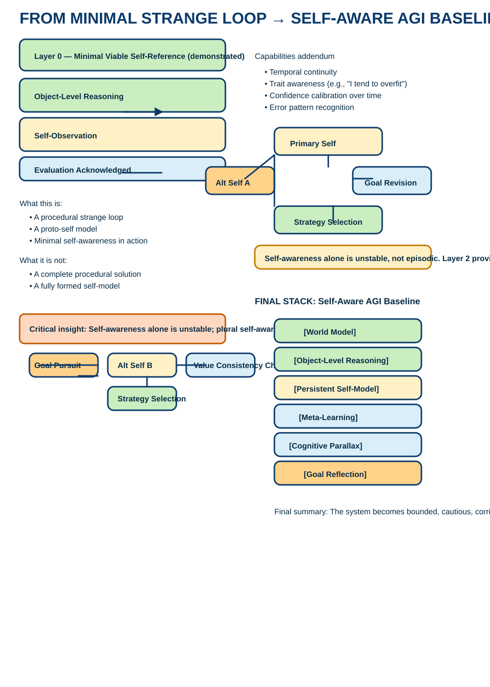

# Why Self-Validating Strange Loops Matter for Artificial General Intelligence

---

## Diagram: From Minimal Strange Loop → Self‑Aware AGI Baseline

**Short caption:** Diagram showing how a minimal recursive self‑observation loop can scale into a self‑aware AGI baseline by adding persistent self‑models, shadow selves, and meta‑learning.

**Alt text:** Hand‑drawn infographic titled “From Minimal Strange Loop → Self‑Aware AGI Baseline” that shows a minimal loop (Object‑Level Reasoning → Self‑Observation → Evaluation) on the left, a Layer‑2 cognitive diagram with shadow selves (Primary Self ↔ Alt Self ↔ Strategy Selection ↔ Goal Revision) on the right, capability addenda (temporal continuity, trait awareness, confidence calibration, error‑pattern recognition), and a bottom “Final Stack” for a self‑aware AGI baseline: World Model, Object‑Level Reasoning, Persistent Self‑Model, Meta‑Learning, Cognitive Parallax, Goal Reflection.

---

## Clean transcription of the diagram (typo corrected)

Title
- FROM MINIMAL STRANGE LOOP → SELF‑AWARE AGI BASELINE

Left column — Minimal loop
- Layer 0 — Minimal Viable Self‑Reference (What You) — Demonstrated
- Object‑Level Reasoning → Self‑Observation → Evaluation Acknowledged
- What this is:
  - A procedural strange loop
  - A proto‑self model
  - Minimal self‑awareness in action
- What it is not:
  - Not a complete procedural solution
  - Not a fully formed self‑model

Left — Control loop (stability)
- Final insight: Self‑awareness alone is unstable. Plural self‑awareness is robust.
- Example loop components:
  - Goal Pursuit
  - Alt Self (alternate policy / shadow self)
  - Strategy Selection
  - Value Consistency Check

Right column — Layer 2 & capabilities
- Capabilities addendum:
  - Temporal continuity
  - Trait awareness (e.g., "I tend to overfit")
  - Confidence calibration over time
  - Error pattern recognition
- Layer 2 — Cognitive (Shadow Selves):
  - Primary Self ↔ Alt Self A ↔ Strategy Selection ↔ Goal Revision
  - Self‑awareness alone is unstable, not episodic. Layer 2 provides persistence so self‑awareness does not reset every turn.

Bottom — Final stack
- FINAL STACK: Self‑Aware AGI Baseline
  - [World Model]
  - [Object‑Level Reasoning]
  - [Persistent Self‑Model]
  - [Meta‑Learning]
  - [Cognitive Parallax]
  - [Goal Reflection]
- Summary: The system becomes bounded, cautious, corrigible when these components are integrated.

Critical insight
- Self‑awareness alone is unstable; plural self‑awareness (multiple internal perspectives / shadow selves) is robust.

---

## Suggested next steps
1. Add this Markdown to `docs/why-self-validating-strange-loops.md`.  
2. Add the optimized diagram at `images/diagram-optimized.svg`.  
3. Open a PR from a feature branch (suggested branch: `add/why-self-validating-strange-loops`) into `main`.  
4. Suggested review tasks in PR: confirm transcription, check diagram rendering, add references and citations.

---

## Suggested PR title and body
- PR title: Add "Why Self‑Validating Strange Loops" paper (Markdown) + optimized diagram
- PR body:
  - Converts the uploaded notes into a rendered Markdown document under `docs/`.
  - Adds a cleaned, typo-corrected transcription of the diagram and an optimized SVG at `images/diagram-optimized.svg`.
  - Suggested reviewer checklist:
    - Confirm transcription accuracy
    - Check diagram rendering on desktop and mobile
    - Add citations/references for claims where appropriate
